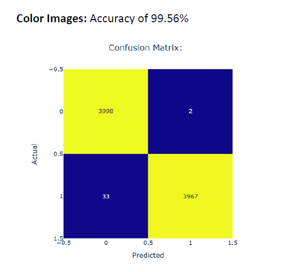
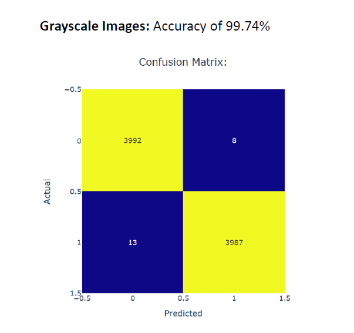
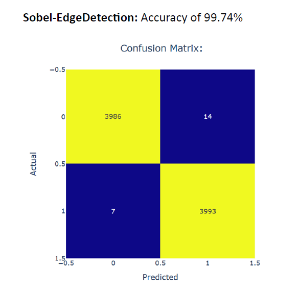
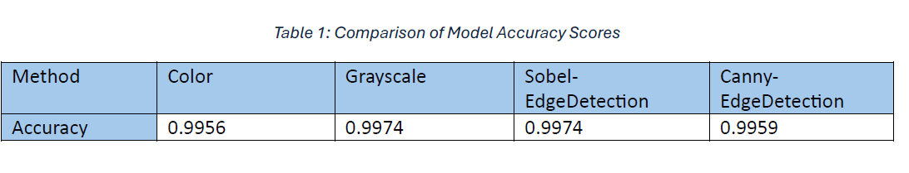
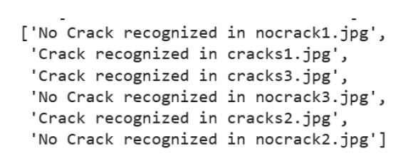
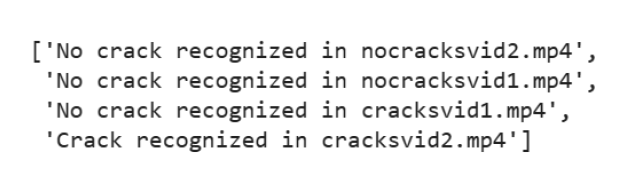
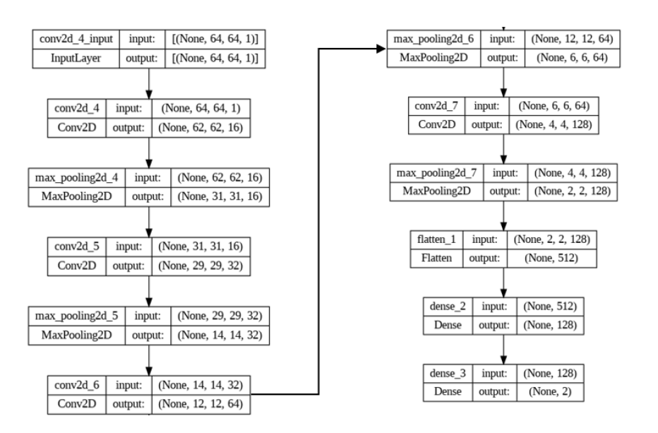

### **Detection of Cracks on Concrete Surfaces Utilizing Convolutional Neural Networks (CNNs) and OpenCV for Preprocessing**

### Project Overview
The project endeavors to tackle the exigent requirement for an efficient and automated system designed to identify surface cracks across diverse infrastructural and industrial environments. Through the synergistic utilization of OpenCV and Convolutional Neural Networks (CNN), this endeavor aims to transform conventional methodologies of crack detection, presenting an enhanced paradigm that is characterized by heightened accuracy, promptness, and proactive intervention. The amalgamation of OpenCV's prowess in computer vision with CNN's proficiency in deep learning not only streamlines the process of surface crack detection but also furnishes a solution that is both scalable and adaptable to real-world scenarios.

The **goal** of this project is to develop a Deep Learning CNN model capable of effectively detecting the presence of cracks in images of concrete surfaces.

### Data Description and Source

The dataset utilized for this project was obtained from Kaggle, accessible through the link: [accessible here](https://www.kaggle.com/datasets/arunrk7/surface-crack-detection/). This dataset comprises images categorized into two classes: images with cracks and images without cracks. Each class consists of 20,000 images. The images are standardized to 227x227 pixels with RGB channels. This dataset serves as the foundation for training and evaluating the performance of the developed model.

### Process

### Tools

- Machine Learning and Deep Learning Algorithms:
    - Artificial Neural Network (ANN)
    - Convolution Neural Network (CNN)
 

- Programming Language:
   - Python [Download here](https://www.python.org/)

### Data Cleaning/Preparation

Load Images with Cracks (resize to 64x64)
Load Images without Cracks
#Split Image Data from Label Data
## Prepare Data for Training
  #Split into train/test
  #normalize data scaling values from 0-1

### Methods

The methodology adopted to construct a proficient predictive model in this project involved a progressive refinement process, commencing with rudimentary processing techniques and a CNN architecture, subsequently iterated to enhance performance. Initially, optimization was pursued utilizing color images, followed by a transition to grayscale images, culminating in the integration of edge detection methodologies.

Initially, an Artificial Neural Network (ANN) was applied to the dataset as a benchmark for comparison with the subsequent CNN model. The process commenced with the implementation of a basic CNN architecture featuring one convolutional layer and two connected layers. Subsequently, the architecture evolved to incorporate a more complex CNN model comprising four convolutional layers and two connected layers. Furthermore, optimization was achieved through the utilization of Canny Images for enhanced performance evaluation.

#### The methods outlined in the attached Jupyter notebook are delineated as follows:
1. Color CNNConcreteCrackIdentification

The dataset consists of color images of concrete surfaces, with positive samples containing cracks and negative samples without cracks. The executed code follows these steps:
  - Reads and resizes the images, generating arrays for both cracked and non-cracked data separately.
  - Concatenates the data and labels for subsequent processing.
  - Divides the dataset into training and testing subsets.
  - Normalizes pixel values to the interval [0, 1].
  - Prepares textual descriptions for target labels.
  - Segregates the data into training and testing sets.
  - Establishes and trains a rudimentary CNN architecture featuring one convolutional layer and two connected layers.
  - Iteratively constructs and trains CNN models with varying numbers of convolutional and connected layers.
  - Assesses and illustrates each model's performance using confusion matrices and classification reports.
  - Identifies the CNN model with four convolutional layers and three connected layers as optimal.
  - Implements early stopping and model checkpoint callbacks for optimization purposes.
  - Trains the model and assesses its performance on validation and test sets.
  - The code explores different CNN architectures and optimization strategies aimed at enhancing model performance.

2. Grayscale CNNConcreteCrackIdentification
The executed code follows these steps:

The provided code executes the following tasks:

  - Reads grayscale images depicting concrete surfaces with and without cracks.
  - Resizes the images to dimensions of 64x64 pixels.
  - Divides the data into training and testing partitions.
  - Normalizes pixel values to the interval [0, 1].
  - Defines and compiles CNN models featuring various architectures, ranging from one to four convolutional layers.
  - Trains each CNN model using the training data.
  - Assesses the performance of each CNN model on the test set.
  - Generates confusion matrices and classification reports for each CNN model.
  - Identifies the CNN model with four convolutional layers and two connected layers for further optimization.
  - Splits the training data into training and validation sets.
  - Implements early stopping and model checkpoint callbacks during the training process.

3. Grayscale with Edge Detection CNNConcreteCrackIdentification

The provided code accomplishes the following tasks:

  - Loads images containing cracks, resizes them to 64x64 pixels, and adds them to the "cracks_data" array.
  - Loads images without cracks, resizes them similarly, and appends them to the "no_cracks_data" array.
  - Combines image data and corresponding labels for both cracked and non-cracked images.
  - Divides the data into training and testing sets.
  - Defines a function to conduct Sobel and Canny edge detection on an image and displays the resulting edges.
  - Applies edge detection to a subset of sample images.
- Prepares Data for Training using Sobel Intensity Images:
  - Applies Sobel edge detection to all images and stores the results in "sobel_img_data".
  - Segregates the data into training and testing sets, normalizes pixel values, and prepares it for training.
  - Constructs a convolutional neural network (CNN) model comprising four convolutional layers, two dense layers, and utilizes Sobel intensity images for training.
  - Trains the model, validates its performance, and saves the best model based on validation accuracy.
  - Evaluates the model on both validation and test sets.
- Prepares Data for Training using Canny Images:
  - Applies Canny edge detection to all images and stores the results in "canny_img_data".
  - Splits the data into training and testing subsets, normalizes pixel values, and readies it for training.
  - Defines a new CNN model with the same architecture as before, utilizing Canny edge images for training.
  - Trains the model, validates its performance, and saves the best model based on validation accuracy.
  - Evaluates the model on both validation and test sets.

4. Application of Best Model to Images/Videos outside of Train/Test Dataset
     
The provided code facilitates concrete crack classification utilizing a trained neural network model based on Sobel edge detection, capable of processing various input types such as images and videos. The code execution comprises the following steps:

  - Imports the previously trained and saved best Sobel-based model.
  - Defines functions for acquiring file paths and extracting frames from video files.
  - Implements a concrete crack classification function that prompts user input to specify the input type (image, video, or batches of images/videos).
  - For image inputs, the function reads and resizes the images, applies Sobel edge detection, normalizes the data, and makes predictions using the loaded model.
  - For video inputs, frames are extracted, Sobel edge detection is applied to each frame, data is normalized, and predictions are made using the loaded model.
  - The function outputs predictions indicating the presence or absence of concrete cracks.
  - This comprehensive approach enables seamless classification of concrete cracks across diverse input formats, offering flexibility and adaptability for real-world applications.

### Results/Findings/Discussion
The following figures and table show confusion matrices for best models from each explored processing method and comparison of their accuracy scores:

#

  # 
  #<em>Grayscale Images</em>
#

Upon comparing the accuracy scores of various models, it becomes apparent that utilizing grayscale or Sobel edge detection yields optimal results. Given that the primary application of such a model is to identify cracks requiring attention, prioritizing the accurate identification of cracks, even at the expense of falsely identified cracks, is deemed beneficial. Consequently, the Sobel edge detection model is selected as the optimal model for this project.

Application of the Sobel edge detection trained model to external images and videos yielded the following outcomes:

. First Scenerio:   * Six images were used, cropped from images of concrete cylinders used as compressive strength samples, were employed, comprising 3 images with cracks present and 3 without.
                    * The Sobel edge detection trained model  accurately predicted all 6 images.

               
  
* Second Scenerio:  * Four short video clips, cropped from videos of sidewalk pathways, were utilized, consisting of 2 videos with cracks present and 2 without.
                    * The model correctly predicted both videos without cracks and 1 of the videos with cracks present.

After an exhaustive exploration of various methodologies, the optimal model emerged as a Convolutional Neural Network (CNN) architecture featuring four convolutional layers and two connected layers, leveraging Sobel-Edge Detection images as input shown below. This meticulously developed model exhibits superior performance characteristics compared to alternative configurations.

Subsequently, a dedicated function was engineered to facilitate the application of the predictive model. This function operates by accepting inputs in the form of single or multiple images/videos, and subsequently furnishes predictions regarding the presence or absence of detected cracks with a high degree of accuracy and reliability.

### Recommendations

In order to further enhance the predictive capabilities of the model, several avenues for future improvement have been identified. These include:

1. Exploration of Additional Preprocessing Techniques and Advanced Architectures: Investigating alternative preprocessing methods and sophisticated neural network architectures could potentially yield improvements in model performance. This may involve experimenting with different edge detection algorithms, image enhancement techniques, or incorporating advanced CNN architectures tailored to the task at hand.
   
2. Utilization of Pretrained Models such as Inception V3 and ResNet: Leveraging pretrained models, such as Inception V3 or ResNet, offers an avenue for enhancing model accuracy and efficiency. By fine-tuning these models on the specific task of crack detection, we can capitalize on the rich feature representations learned from large-scale datasets.
   
3. Extension of Application to Recognize Specific Types of Defects: Extending the application scope to encompass the recognition of various types of defects beyond cracks presents an opportunity for broader utility. By training the model to identify specific defect patterns or anomalies, we can enhance its versatility and applicability across diverse scenarios, such as identifying spalling, delamination, or corrosion in addition to cracks.

These avenues for future work hold promise for further advancing the model's performance and applicability, paving the way for more robust and effective defect detection systems in infrastructural and industrial settings.

### Conclusion

* In conclusion, the "Surface Crack Detection using OpenCV and CNN" project successfully tackled the pressing need for an automated system to identify surface cracks in diverse infrastructural and industrial environments. By leveraging OpenCV and Convolutional Neural Networks (CNN), the project introduced a more accurate, timely, and proactive approach to crack detection.
  
* Exploration of various processing methods revealed that the Sobel-EdgeDetection model and grayscale images achieved optimum performance, each boasting an impressive accuracy of 99.74%. Prioritizing the accurate identification of cracks, even with a slight increase in false positives, was deemed crucial for practical applications.

* Application of the Sobel-EdgeDetection model to external images and videos showcased its effectiveness in identifying cracks across different scenarios. The predictive model, based on a CNN architecture with 4 convolutional layers and 2 connected layers, demonstrated its applicability in real-world situations.

* While the project achieved significant success, there are opportunities for future exploration and enhancement. Further research could focus on advanced preprocessing techniques, integration of pretrained models, and extension of the application to recognize specific types of defects in diverse scenarios. Additionally, scaling the model to accommodate larger image sizes could enhance its effectiveness in practical settings.

* Overall, the "Surface Crack Detection using OpenCV and CNN" project represents a substantial advancement in structural health monitoring, offering a potent tool for the early detection and proactive maintenance of surface cracks in critical infrastructures.

